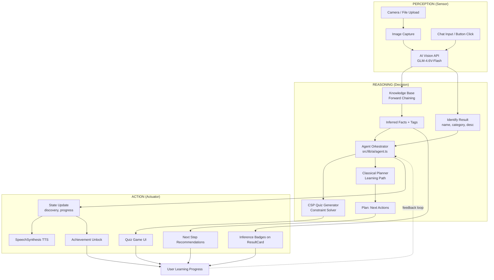

# What's This?

> **Tugas Mata Kuliah Artificial Intelligence — Semester 4**

---

- Richie Hujaya (241110258)
- Anthony Louis (241110249)
- Trevan Edgard (241110265)
- Suryanata Yaptanto (241111143)

## 1. Ide Project

**"What's This?"** adalah aplikasi web edukasi interaktif untuk anak-anak yang memanfaatkan teknologi AI (Computer Vision & Browser Text-to-Speech) untuk membantu anak mengenali objek di sekitar mereka.

### Latar Belakang

Anak-anak secara alami memiliki rasa ingin tahu yang tinggi terhadap lingkungan sekitar. Mereka sering bertanya *"ini apa?"* saat melihat benda baru. Metode belajar konvensional seperti buku gambar dan kartu flash memiliki keterbatasan — kontennya statis, jumlah terbatas, dan tidak responsif terhadap rasa ingin tahu anak secara real-time.

### Solusi

Aplikasi ini mengubah proses belajar menjadi pengalaman yang dinamis:

```
Anak arahkan kamera ke benda → AI mengenali benda tersebut
→ App menjelaskan dengan bahasa anak-anak → Browser TTS membacakan penjelasan
→ Mini-game memperkuat pemahaman
```

Dengan pendekatan ini, anak bisa belajar dari **objek apa saja** kapan saja dan di mana saja, tanpa dibatasi oleh konten statis.

### Teknologi Utama

| Teknologi | Fungsi |
|---|---|
| Next.js 16 + TypeScript | Framework full-stack |
| Z-AI SDK (GLM-4.6V-Flash) | AI Vision untuk mengenali objek dari gambar |
| Z-AI SDK (GLM-4.5-Flash) | AI Chat untuk menjawab pertanyaan anak |
| Z-AI SDK (GLM-4.7-Flash) | AI generate soal kuis |
| Browser SpeechSynthesis | Text-to-Speech bawaan browser untuk membacakan penjelasan |
| Tailwind CSS 4 + shadcn/ui | UI/UX responsive dan ramah anak |
| Prisma + SQLite | Penyimpanan data user, riwayat, dan achievement |
| Framer Motion | Animasi agar app terasa hidup |
| @dnd-kit | Drag-and-drop untuk puzzle game |

---

## 2. Fitur-Fitur Penting

### Fitur Inti AI & Kamera

| No | Fitur | Deskripsi |
|---|---|---|
| 1 | **AI Object Recognition** | Menggunakan model GLM-4.6V-Flash (VLM) untuk mengenali objek dari foto. AI mengembalikan nama objek, emoji, deskripsi ramah anak, fakta menarik, dan kategori — semua dalam bahasa yang dipilih user. |
| 2 | **Real-Time Camera** | Integrasi kamera device via WebRTC. Menggunakan `getUserMedia()` dengan resolusi ideal 1280x720. |
| 3 | **Upload Gambar** | Alternatif saat kamera tidak tersedia, user bisa mengunggah gambar dari galeri perangkat via `<input type="file">`. |
| 4 | **Ganti Kamera (Depan/Belakang)** | Tombol toggle untuk berpindah antara kamera depan (`user`) dan belakang (`environment`) menggunakan `enumerateDevices()` untuk mendeteksi perangkat video. |
| 5 | **Rotasi Gambar** | Gambar hasil identifikasi bisa diputar per 90° menggunakan canvas transformation agar tampil dengan orientasi yang benar. Rotasi terjadi setelah identifikasi AI selesai. |
| 6 | **Text-to-Speech (Browser)** | Setiap objek yang berhasil dikenali otomatis dibacakan oleh Browser TTS (`window.speechSynthesis`). Menggunakan bahasa sesuai pilihan user (en-US, id-ID, zh-CN) dengan rate 0.85 dan pitch 1.1. |

### Fitur Autentikasi & User

| No | Fitur | Deskripsi |
|---|---|---|
| 7 | **Register & Login** | Sistem autentikasi berbasis cookie session. Password di-hash menggunakan bcryptjs dengan salt rounds 10. Session bertahan 30 hari. User bisa login pakai email atau username. |
| 8 | **Guest Mode** | User bisa langsung menggunakan aplikasi tanpa mendaftar. Riwayat dan achievement disimpan di localStorage, dan akan dipindahkan jika user memutuskan daftar nanti. |
| 9 | **Profil Pengguna** | User dapat mengubah nama tampilan, tema warna, dan bahasa. Semua preferensi tersimpan di database dan otomatis dimuat saat login. |
| 10 | **Pro Membership** | Simulasi upgrade ke akun Pro. Status isPro tersimpan di database dengan badge visual di profil. |

### Fitur Belajar & Game

| No | Fitur | Deskripsi |
|---|---|---|
| 11 | **Riwayat Discovery** | Setiap objek yang berhasil dikenali beserta gambar, nama, deskripsi, dan fakta menarik tersimpan di database. User bisa melihat hingga 50 penemuan terakhir, menghapus satu item, atau menghapus semua sekaligus. |
| 12 | **Listen & Identify Game** | Game dengar-dan-identifikasi: AI membacakan nama objek, lalu anak memilih gambar yang sesuai dari 4 opsi acak. Skor dilacak (benar/salah) dan jawaban benar memicu achievement `listen_master`. |
| 13 | **Quiz Challenge** | Kuis pilihan ganda yang menampilkan gambar objek dan 5 opsi jawaban (1 benar + 4 pengecoh). Pertanyaan digenerate oleh AI via `/api/quiz/generate` dengan sistem preloading/caching. Skor disimpan di database dan perfect score membuka achievement. |
| 14 | **Puzzle Game** | Gambar yang dipindai dipotong menjadi potongan 2x2 yang diacak. Anak menyusun potongan kembali dengan drag-and-drop `@dnd-kit`. Selesai dengan benar memicu feedback suara dan achievement. |
| 15 | **AI Chat Buddy** | Chatbot AI untuk anak-anak yang didukung model GLM-4.5-Flash. Mendukung percakapan multi-turn dengan mengingat riwayat chat, dan merespons sesuai bahasa yang dipilih. |

### Fitur Gamifikasi & Kustomisasi

| No | Fitur | Deskripsi |
|---|---|---|
| 16 | **Achievement System (9 Badge)** | Sistem pencapaian dengan 9 badge: First Discovery 🔍, Explorer 🧭 (5 scan), Scientist 🔬 (10 scan), Professor 🎓 (20 scan), Perfect Score 💯, Puzzle Master 🧩, Good Listener 👂, Chatty Kid 💬, dan Helper ⭐. Milestone scan (5, 10, 20 objek) dicek otomatis saat unlock achievement. |
| 17 | **Multi-Bahasa (3 Bahasa)** | Seluruh UI dan respons AI tersedia dalam 3 bahasa: English 🇬🇧, Bahasa Indonesia 🇮🇩, dan 简体中文 🇨🇳. Terdapat 170+ string yang diterjemahkan secara manual (termasuk nama langkah planner dan pesan *toast* scan). History items menyimpan `nameOptions`, `descriptionOptions`, dan `funFactOptions` dalam bentuk JSON untuk memungkinkan switch bahasa tanpa re-identifikasi. |
| 18 | **6 Tema Warna** | Tersedia 6 tema gradient: Luminous Meadow 🌈, Coral Dreams 🌊, Whispering Woods 🌲, Golden Hour 🌅, Twilight Reverie 🌙, dan Sugar Paradise 🍬. Hanya 1 tema default gratis, 5 tema lainnya bersifat Pro. Pilihan tema tersimpan per pengguna di database. |
| 19 | **User Feedback** | User dapat memberikan rating bintang 1–5 beserta komentar opsional via `/api/feedback`. Mengirim feedback otomatis membuka achievement "Helper". |
| 20 | **Responsive Mobile-First** | Desain dibangun dengan pendekatan mobile-first menggunakan Tailwind CSS 4. Layout menyesuaikan dari HP ke desktop dengan animasi Framer Motion. |

---

## 3. Arsitektur API

| Method | Endpoint | Deskripsi | Auth |
|--------|----------|-----------|------|
| POST | `/api/auth/register` | Registrasi user baru dengan bcrypt | Tidak |
| POST | `/api/auth/login` | Login dengan email atau username | Tidak |
| POST | `/api/auth/logout` | Hapus cookie session | Tidak |
| GET | `/api/auth/me` | Cek user yang sedang login | Ya* |
| PUT | `/api/auth/update` | Update displayName, language, theme | Ya |
| POST | `/api/auth/upgrade` | Upgrade akun ke Pro | Ya |
| POST | `/api/identify` | Identifikasi objek dari gambar (VLM) | Ya |
| POST | `/api/chat` | AI chat dengan multi-turn support | Ya |
| GET/POST | `/api/achievements` | List achievement / Unlock achievement baru | Ya |
| POST | `/api/feedback` | Submit rating dan komentar | Ya |
| GET/POST/DELETE | `/api/history` | Lihat 50 riwayat terakhir / Simpan item baru / Hapus semua | Ya |
| DELETE | `/api/history/[id]` | Hapus satu item riwayat | Ya |
| POST | `/api/quiz` | Simpan skor quiz | Ya |
| POST | `/api/quiz/generate` | Generate pertanyaan quiz dari riwayat | Ya |

*Return 401 jika tidak terautentikasi.

---

## 4. Database Schema

Menggunakan Prisma ORM dengan SQLite. Terdiri dari 5 model:

- **User**: id, username (unique), email (unique), password (hashed), displayName, avatar, isPro, theme, language, createdAt, updatedAt
- **HistoryItem**: id, userId (FK), name, emoji, description, funFact, category, imageData, nameOptions (JSON), descriptionOptions (JSON), funFactOptions (JSON), createdAt
- **Achievement**: id, userId (FK), type, title, emoji, unlockedAt — unique constraint pada (userId, type)
- **Feedback**: id, userId (FK), rating (1-5), comment, createdAt
- **QuizScore**: id, userId (FK), score, total, createdAt

---

## 5. Struktur Project

```
src/
├── app/
│   ├── api/
│   │   ├── auth/
│   │   │   ├── login/route.ts
│   │   │   ├── register/route.ts
│   │   │   ├── logout/route.ts
│   │   │   ├── me/route.ts
│   │   │   ├── update/route.ts
│   │   │   └── upgrade/route.ts
│   │   ├── identify/route.ts
│   │   ├── chat/route.ts
│   │   ├── achievements/route.ts
│   │   ├── feedback/route.ts
│   │   ├── history/
│   │   │   ├── route.ts
│   │   │   └── [id]/route.ts
│   │   ├── quiz/
│   │   │   ├── route.ts
│   │   │   └── generate/route.ts
│   │   └── route.ts
│   ├── page.tsx
│   ├── layout.tsx
│   └── globals.css
├── lib/
│   ├── auth.ts
│   ├── db.ts
│   ├── i18n.ts
│   ├── themes.ts
│   ├── helpers.ts
│   ├── retry.ts
│   ├── zai-queue.ts
│   └── utils.ts
├── components/
│   ├── ui/            (shadcn/ui primitives)
│   ├── tabs/          (HomeTab, LearnTab, GamesTab, ChatTab, ProfileTab, QuizGame, PuzzleGame)
│   ├── Sidebar.tsx
│   ├── MobileTabBar.tsx
│   ├── Header.tsx
│   ├── CameraView.tsx
│   ├── AuthScreen.tsx
│   ├── ResultCard.tsx
│   ├── ResultCard_new.tsx
│   ├── SettingsDialog.tsx
│   ├── CelebrationOverlay.tsx
│   ├── Confetti.tsx
│   └── ThemePortal.tsx
├── hooks/
│   ├── use-mobile.ts
│   └── use-toast.ts
└── prisma/
    └── schema.prisma
```

---

## 6. Cara Menjalankan

### Prasyarat
- Node.js 18+
- SQLite (sudah termasuk via Prisma)

### Langkah Instalasi

1. Install dependensi:
```bash
npm install
```

2. Buat file `.env` di root directory:
```
DATABASE_URL="file:./db/custom.db"
Z_AI_API_KEY="your_api_key_here"
```

3. Push schema database:
```bash
npm run db:push
```

4. Jalankan development server:
```bash
npm run dev
```

Aplikasi akan tersedia di `http://localhost:3000`.

### Production Build

```bash
npm run build
npm run start
```

---

## Bagian UAS: Integrasi AI Klasik (Symbolic AI)

### 1.1 Konsistensi dengan Project UTS

Proyek UTS menggunakan **subsymbolic AI** (neural network / deep learning) melalui API GLM Vision untuk mengenali objek dari gambar. Pada UAS, aplikasi dan kasus yang **sama** diperkaya dengan **symbolic AI** klasik untuk memberikan *reasoning* terstruktur:

| Fitur UTS | Pengembangan UAS | Modul AI |
|-----------|-----------------|----------|
| Identifikasi objek via AI vision (GLM-4.6V-Flash) | + Inferensi logika (KB *forward chaining*) untuk menambah pengetahuan dari fakta yang terdeteksi | *Knowledge Base* |
| *Quiz challenge* dengan soal dari AI (GLM-4.7-Flash) | + CSP *solver* untuk menentukan struktur soal (objek, urutan, pengecoh) secara terstruktur | CSP |
| *Progress* user (riwayat & *achievement*) | + *Classical planner* untuk rekomendasi langkah belajar berikutnya | *Classical Planning* |
| Keseluruhan aplikasi | + Arsitektur agen formal dengan siklus *perceive* → *reason* → *act* | *Agent Architecture* |

---

### 2. Pemodelan CSP (*Constraint Satisfaction Problem*)

Pemodelan CSP digunakan untuk **menentukan struktur soal *quiz*** — objek mana yang muncul, dalam urutan apa, dan pengecoh apa yang ditampilkan. CSP berjalan di setiap sesi *quiz* sebagai penentu struktur; AI (GLM-4.7-Flash) hanya digunakan untuk **men-generate teks** pertanyaan dari struktur yang sudah dihasilkan CSP.

#### Notasi Formal V / D / C

```
V = {Q₁, Q₂, Q₃, Q₄, Q₅}          (5 slot pertanyaan per sesi quiz)

D_Qi = historyObjects ∪ defaultPool  (domain per variabel)

C = {
  C₁: ∀i ≠ j → Qi.objek ≠ Qj.objek                              (unique)
  C₂: ∀i(1..4) → Qi.kategori ≠ Q(i+1).kategori                  (no consecutive same category)
  C₃: ∀i(1..4) → Qi.difficulty ≤ Q(i+1).difficulty              (difficulty non-decreasing)
  C₄: ∀i → distractors ⊆ (D \ {Qi.name}) ∧ |distractors| = 4    (distractors valid)
  C₅: distractors[i] ≠ distractors[j] untuk i ≠ j               (distractors unique)
  C₆: prioritaskan distractor dengan kategori = Qi.category      (prefer same-category distractors)
}
```

#### Kriteria `getDifficulty()` (Deterministik)

Tingkat kesulitan ditentukan secara deterministik berdasarkan kategori dan panjang nama objek:

| Kategori | *Base Difficulty* | Contoh |
|----------|-------------------|--------|
| Animals, Food, Toys | 1 (sangat umum) | Cat, Apple, Ball |
| Vehicles, Nature | 2 (umum) | Car, Sun |
| Plants, Clothing, Furniture, School, Sports | 3 (familiar) | Tree, Shirt, Chair |
| Household, Electronics, Tools, Music | 4 (kurang umum) | TV, Guitar |
| Art, People | 5 (spesifik / abstrak) | Painting, Doctor |

```
difficulty = Math.min(5, BASE[category] + (name.length > 8 ? 1 : 0))
```

#### Algoritma *Solver*

CSP *solver* menggunakan **backtracking dengan MRV *heuristic* + *forward checking***:

1. **Bangun domain** = `historyObjects ∪ DEFAULT_OBJECT_POOL` (deduplikasi berdasarkan nama)
2. **MRV (*Minimum Remaining Values*)** : Pilih slot yang belum terisi dengan domain paling sedikit
3. ***Forward checking*** : Setelah menetapkan nilai, hapus nilai dari domain slot lain yang melanggar C₂ (kategori berurutan sama) atau C₃ (kesulitan menurun)
4. **Backtracking** : Jika domain kosong, kembalikan ke keputusan sebelumnya dan coba nilai lain
5. ***Generate distractors*** : Untuk setiap slot terisi, pilih 4 pengecoh — prioritaskan kategori yang sama dengan jawaban (C₆)

#### *Default Pool*

Ketika *history* user masih sedikit (< 5 objek), *solver* menggunakan **15 objek umum** sebagai *fallback*:

```
Animals: Cat, Dog, Fish, Bird  (difficulty 1)
Food:    Apple, Banana, Carrot, Milk  (difficulty 1)
Toys:    Ball, Doll  (difficulty 1)
Vehicles: Car, Airplane, Bicycle  (difficulty 2)
Nature:  Sun, Tree  (difficulty 2)
```

#### Alur CSP + AI

```
                    ┌──────────────────┐
                    │  historyObjects  │
                    │  (riwayat user)  │
                    └────────┬─────────┘
                             │
                             ▼
                    ┌─────────────────────┐
                    │  CSP Solver         │  ← Backtracking + MRV + Forward Checking
                    │  (solveQuizCSP)     │
                    └──────────┬──────────┘
                               │ 5 objek + 4 distractors per objek
                               ▼
                    ┌─────────────────────┐
                    │  GLM-4.7-Flash      │  ← Hanya teks pertanyaan
                    │  (generate teks)    │
                    └──────────┬──────────┘
                               │
                               ▼
                    ┌─────────────────────┐
                    │  UI QuizGame        │
                    │  5 opsi per soal    │
                    └─────────────────────┘
```

**CSP selalu menentukan struktur** (objek mana, urutan, pengecoh). **AI hanya menghasilkan teks** pertanyaan dan narasi yang ramah anak. Jika CSP gagal menemukan solusi, *fallback* ke AI-*only* tanpa struktur CSP.

---

### 3. Representasi Pengetahuan

*Knowledge base* berisi **30 objek** dengan **lebih dari 140 fakta** dan **12 aturan inferensi**, diimplementasikan menggunakan ***forward chaining inference engine*** di `src/lib/ai/knowledgeBase.ts`.

#### Predikat (7 jenis)

| Predikat | Argumen | Makna | Contoh |
|----------|---------|-------|--------|
| `isA(X, Y)` | X = objek, Y = kategori | X adalah jenis Y | `isA(kucing, hewan)` |
| `hasProperty(X, Y)` | X = objek, Y = sifat | X memiliki sifat Y | `hasProperty(kucing, berbulu_halus)` |
| `canDo(X, Y)` | X = objek, Y = aksi | X bisa melakukan Y | `canDo(kucing, berjalan)` |
| `livesIn(X, Y)` | X = objek, Y = habitat | X hidup di Y | `livesIn(ikan, air)` |
| `hasColor(X, Y)` | X = objek, Y = warna | X berwarna Y | `hasColor(pisang, kuning)` |
| `hasSound(X, Y)` | X = objek, Y = suara | X bersuara Y | `hasSound(kucing, mengeong)` |
| `hasDiet(X, Y)` | X = objek, Y = jenis makanan | X memakan Y | `hasDiet(kucing, daging)` |

#### Aturan Inferensi (12 *rules* — diaudit tanpa konflik)

| *Rule* | *Antecedent* | *Consequent* | Catatan |
|--------|-------------|--------------|---------|
| mamalia | isA(X, hewan) ∧ hasProperty(X, berbulu_halus) | isA(X, mamalia) | Predikat `berbulu_halus` ≠ `berbulu_tebal` (unggas) |
| unggas | isA(X, hewan) ∧ hasProperty(X, berbulu_tebal) ∧ canDo(X, bertelur) | isA(X, unggas) | Burung, ayam |
| ikan | isA(X, hewan) ∧ hasProperty(X, bersisik) ∧ livesIn(X, air) | isA(X, ikan) | Ikan |
| karnivora | isA(X, hewan) ∧ hasDiet(X, daging) | hasProperty(X, karnivora) | Hewan pemakan daging |
| herbivora | isA(X, hewan) ∧ hasDiet(X, tumbuhan) | hasProperty(X, herbivora) | Hewan pemakan tumbuhan |
| hewan_bergerak | isA(X, hewan) | canDo(X, bergerak) | Semua hewan bisa bergerak |
| hewan_bersuara | isA(X, hewan) | canDo(X, bersuara) | Semua hewan bisa bersuara |
| kendaraan_darat | isA(X, kendaraan) ∧ hasProperty(X, beroda) | canDo(X, berjalan_di_darat) | Mobil, sepeda, kereta |
| kendaraan_terbang | isA(X, kendaraan) ∧ hasProperty(X, bersayap) | canDo(X, terbang) | Pesawat |
| makanan_sehat | isA(X, makanan) ∧ hasProperty(X, alami) | hasProperty(X, sehat) | Buah, sayur |
| tumbuhan_hijau | isA(X, tumbuhan) | hasColor(X, hijau) | Pohon |
| alam_bersinar | isA(X, alam) ∧ hasProperty(X, bersinar) | canDo(X, memberi_cahaya) | Matahari, bintang |

#### Algoritma *Forward Chaining*

```
function forwardChain(knownFacts, rules, maxIterations):
    workingSet = knownFacts
    newFacts = []
    iteration = 0
    changed = true

    while changed AND iteration < maxIterations:
        changed = false
        iteration++

        for each rule in rules:
            for each objName in objectNames:
                if all antecedents match with objName binding:
                    build consequent with objName binding
                    if consequent not already in workingSet:
                        add to workingSet
                        add to newFacts
                        record derivation
                        changed = true

    return { newFacts, derivations }
```

#### *Seed Facts* dari AI Vision

Saat user memindai objek, AI Vision (GLM-4.6V-Flash) mengembalikan `attributes: string[]` yang dipetakan ke fakta awal melalui dua mekanisme:

**1. ATTRIBUTE_TO_FACTS** — 29 atribut *vision* dipetakan ke fakta predikat:

```
"furry"       → hasProperty(__OBJ__, berbulu_halus)
"eats_meat"   → hasDiet(__OBJ__, daging)
"flies"       → canDo(__OBJ__, terbang)
"swims"       → livesIn(__OBJ__, air)
"lays_eggs"   → canDo(__OBJ__, bertelur)
"barks"       → hasSound(__OBJ__, menggonggong)
"meows"       → hasSound(__OBJ__, mengeong)
... (29 mapping total)
```

**2. CATEGORY_FACT_MAP** — 17 kategori dipetakan ke fakta `isA`:

```
Animals     → isA(__OBJ__, hewan)
Food        → isA(__OBJ__, makanan)
Vehicles    → isA(__OBJ__, kendaraan)
Nature      → isA(__OBJ__, alam)
Toys        → isA(__OBJ__, mainan)
Plants      → isA(__OBJ__, tumbuhan)
... (17 kategori total)
```

#### Multi-Bahasa

Objek dari berbagai bahasa dinormalisasi ke bentuk kanonik Bahasa Indonesia melalui `LANGUAGE_ALIASES` (60+ *alias* dari Inggris dan Mandarin ke Indonesia). Label *badge* inferensi (seperti "Mamalia", "Karnivora") mengikuti bahasa UI user (en/id/zh).

#### Validasi Programatik

Fungsi `validateKnowledgeBase()` menjalankan pemeriksaan otomatis:
- Setiap *rule* memiliki minimal satu objek yang cocok dengan *antecedents*-nya
- Semua predikat yang digunakan valid
- Setiap fakta memiliki jumlah argumen yang cukup (minimum 2)
- Tidak ada ID *rule* yang duplikat

#### Contoh Inferensi: Kucing

**Input dari AI Vision:**
- Kategori: `Animals`
- Atribut: `["furry", "eats_meat", "has_tail"]`

***Seed facts*** **yang dibangun:**
```
isA(kucing, hewan)                         [dari kategori Animals]
hasProperty(kucing, berbulu_halus)         [dari furry]
hasDiet(kucing, daging)                    [dari eats_meat]
hasProperty(kucing, berekor)               [dari has_tail]
```

***Forward chaining* menghasilkan 4 inferensi:**

| *Rule* yang Terpicu | Fakta Baru | *Badge* |
|---------------------|-----------|---------|
| mamalia | `isA(kucing, mamalia)` | 🦁 Mamalia |
| karnivora | `hasProperty(kucing, karnivora)` | 🥩 Karnivora |
| hewan_bergerak | `canDo(kucing, bergerak)` | 🐾 Bisa bergerak |
| hewan_bersuara | `canDo(kucing, bersuara)` | 🗣️ Bersuara |

Keempat *badge* ini ditampilkan di `ResultCard` dengan *tooltip* derivasi untuk masing-masing.

---

### 4. *Classical Planning*

*Planner* merekomendasikan **langkah belajar berikutnya** berdasarkan *progress* user saat ini, menggunakan algoritma ***forward search* dengan *goal proximity heuristic***.

#### Definisi *State*

```
State = {
  discoveredObjects: string[],    // objek yang sudah dipindai
  categoriesSeen: string[],       // kategori yang sudah ditemukan
  quizCompleted: boolean,          // status quiz
  puzzleCompleted: boolean,        // status puzzle
  listenScore: number,             // skor listen game
  chatCount: number,               // jumlah chat dengan AI
}
```

#### *Goal*

```
Goal G:
  discoveredObjects.size ≥ 5 ∧
  {"Animals", "Food", "Nature"} ⊆ categoriesSeen ∧
  quizCompleted = true ∧
  puzzleCompleted = true ∧
  listenScore ≥ 2
```

#### *Actions* (9 aksi)

| *Action* | *Precondition* | *Effect* |
|----------|---------------|----------|
| `scan_first_object` | discoveredObjects.size = 0 | discoveredObjects +1 |
| `scan_animal` | discoveredObjects.size > 0 ∧ Animals ∉ categoriesSeen | discoveredObjects +1, Animals ∈ categoriesSeen |
| `scan_food` | discoveredObjects.size > 0 ∧ Food ∉ categoriesSeen | discoveredObjects +1, Food ∈ categoriesSeen |
| `scan_nature` | discoveredObjects.size > 0 ∧ Nature ∉ categoriesSeen | discoveredObjects +1, Nature ∈ categoriesSeen |
| `discover_more` | discoveredObjects.size > 0 ∧ discoveredObjects.size < 5 | discoveredObjects +1 |
| `take_quiz` | discoveredObjects.size ≥ 3 ∧ quizCompleted = false | quizCompleted = true |
| `solve_puzzle` | discoveredObjects.size ≥ 1 ∧ puzzleCompleted = false | puzzleCompleted = true |
| `listen_game` | discoveredObjects.size ≥ 3 | listenScore +1 |
| `chat_with_ai` | discoveredObjects.size ≥ 1 | chatCount +1 |

#### Algoritma *Forward Search*

```
function generatePlan(state, goal, actions):
    plan = []
    current = state
    visited = Set()          // cegah infinite loop

    while not isGoalReached(current, goal) AND |plan| < MAX_STEPS:
        visited.add(hash(current))

        // Filter aksi yang precondition-nya terpenuhi
        applicable = filter(actions, a => a.precondition(current)
                            AND hash(a.effect(current)) not in visited)

        if applicable.length == 0: break     // dead end

        // Heuristic: pilih aksi dengan goalProximityDelta tertinggi
        // goalProximityDelta = jumlah sub-goal yang berubah false→true
        // Sub-goal: size≥5, 3 kategori, quiz, puzzle, listen≥2
        // Tie-break: aksi pertama dalam daftar (deterministik)

        bestAction = argmax(applicable, a => goalProximityDelta(current, a.effect(current), goal))
        plan.push(bestAction)
        current = bestAction.effect(current)

    return plan    // urutan aksi dari sekarang sampai goal
```

#### Contoh *Plan*

***State* awal:** `discoveredObjects = {kucing, apel} (size=2)`, `categoriesSeen = {Animals, Food}`

| Langkah | *Action* | Efek terhadap *State* | *Delta Goal* |
|---------|----------|----------------------|--------------|
| 1 | `discover_more` | discoveredObjects: 2 → 3 | Mendekati size ≥ 5 |
| 2 | `scan_nature` | Nature ✓, discoveredObjects: 3 → 4 | 1 sub-*goal* terpenuhi |
| 3 | `discover_more` | discoveredObjects: 4 → 5 | Size ≥ 5 tercapai |
| 4 | `take_quiz` | quizCompleted = true | 1 sub-*goal* terpenuhi |
| 5 | `solve_puzzle` | puzzleCompleted = true | 1 sub-*goal* terpenuhi |
| 6 | `listen_game` | listenScore: 0 → 1 | Mendekati threshold |
| 7 | `listen_game` | listenScore: 1 → 2 | **GOAL tercapai** |

*Planner* **stateless** — dipanggil ulang setiap kali *state* user berubah (*scan*, *quiz*, *puzzle* selesai). 3 langkah pertama ditampilkan di HomeTab / ProfileTab sebagai kartu rekomendasi.

---

### 5. Desain Sistem Agen

#### Tipe Agen: *Goal-Based Agent with Utility Heuristic*

Agen bersifat **stateless** — tidak menyimpan *state* internal. *State* diterima dari luar (*database* / React *state*) setiap siklus.

#### Siklus *Perceive* → *Reason* → *Act*

```
function runCycle(currentState, input, historyObjects, language):
    // 1. PERCEIVE
    perception = ekstrak data dari sensor input (image → vision API / click / event)

    // 2. UPDATE STATE
    newState = updateState(currentState, input.type)

    // 3. REASON
    inferredTags = KB.forwardChain(perception.objName, attributes)
    quizStructure = CSP.solve(historyObjects)
    planSteps = Planner.generatePlan(newState, goal, actions)

    // 4. ACT
    commands = {
        displayNextSteps: planSteps.slice(0, 3),    // 3 langkah pertama
        inferredTags: inferredTags,                   // badge inferensi
        quizStructure: quizStructure,                 // struktur quiz
    }

    return { newState, commands }
```

#### Arsitektur



#### Fungsi Orkestrator

```typescript
// Stateless — state diterima dari luar
export function runCycle(
  currentState: LearningState,
  input: PerceptionInput,
  historyObjects: QuizObject[],
  language: string,
): AgentOutput {
  // 1. PERCEIVE
  // 2. UPDATE STATE based on input type
  // 3. REASON: KB + CSP + Planner
  // 4. ACT: build actuator commands
  return { newState, commands };
}
```

Tipe *input* yang diterima agen:

| Tipe *Input* | Dipicu Saat | Efek pada *State* |
|-------------|-------------|-------------------|
| `scan_complete` | Objek baru berhasil dipindai | `discoveredObjects` + `categoriesSeen` bertambah |
| `quiz_complete` | *Quiz* selesai dikerjakan | `quizCompleted` = true |
| `puzzle_complete` | *Puzzle* selesai disusun | `puzzleCompleted` = true |
| `listen_complete` | *Listen game* selesai | `listenScore` +1 |
| `chat_sent` | Chat dengan AI dikirim | `chatCount` +1 |
| `app_launch` | Aplikasi dibuka | Tidak ada perubahan |

---

### 6. Simulasi Kasus

**Skenario:** Ani (anak usia 5 tahun) membuka aplikasi "What's This?" dan memindai kucing peliharaannya.

#### Langkah 1: Kamera → AI Vision

Ani mengarahkan kamera ke kucing dan menekan tombol *scan*. Gambar dikirim ke GLM-4.6V-Flash.

**Hasil AI Vision:**
```json
{
  "name": "Kucing",
  "category": "Animals",
  "attributes": ["furry", "eats_meat", "has_tail"],
  "description": "Kucing adalah hewan berbulu halus yang suka bermain dan tidur.",
  "funFact": "Kucing bisa tidur hingga 16 jam sehari!"
}
```

#### Langkah 2: *Knowledge Base* — *Forward Chaining*

*Seed facts* dibangun dari kategori dan atribut:
- `isA(kucing, hewan)` — dari kategori Animals
- `hasProperty(kucing, berbulu_halus)` — dari `furry`
- `hasDiet(kucing, daging)` — dari `eats_meat`
- `hasProperty(kucing, berekor)` — dari `has_tail`

*Forward chaining* menghasilkan 4 inferensi:

| *Rule* | Fakta Baru | *Badge* |
|--------|-----------|---------|
| mamalia | `isA(kucing, mamalia)` | 🦁 Mamalia |
| karnivora | `hasProperty(kucing, karnivora)` | 🥩 Karnivora |
| hewan_bergerak | `canDo(kucing, bergerak)` | 🐾 Bisa bergerak |
| hewan_bersuara | `canDo(kucing, bersuara)` | 🗣️ Bersuara |

*Badge* inferensi ditampilkan di `ResultCard`:
```
🐈 Kucing
[🦁 Mamalia] [🥩 Karnivora] [🐾 Bisa bergerak] [🗣️ Bersuara]
```

#### Langkah 3: Agen — *Planner*

Agen memperbarui *state*: `discoveredObjects = {kucing}`, `categoriesSeen = {Animals}`.

*Planner* menghasilkan rekomendasi:
```
1. scan_food         → scan makanan untuk membuka kategori Food
2. scan_nature       → scan alam untuk membuka kategori Nature
3. discover_more     → scan 3+ objek lagi untuk mencapai threshold quiz
```

Rekomendasi ditampilkan di HomeTab dan ProfileTab sebagai kartu "Langkah Belajar Berikut" yang dapat diklik untuk navigasi. Nama dan deskripsi langkah mengikuti bahasa yang dipilih user melalui i18n.

#### Langkah 4: *Quiz* — CSP

Setelah Ani memiliki 3+ objek, tombol *quiz* aktif. Saat ditekan:
1. **CSP *solver*** menentukan 5 objek soal + 4 pengecoh per soal (total 25 opsi) dengan urutan *difficulty non-decreasing* dan kategori tidak berurutan sama
2. **GLM-4.7-Flash** men-generate teks pertanyaan dari struktur CSP
3. UI menampilkan *quiz* 5 soal dengan gambar + 5 opsi per soal (1 jawaban + 4 pengecoh)

#### Langkah 5: Jawab Benar → *Achievement*

Ani menjawab semua soal dengan benar → *achievement* `Perfect Score 💯` terbuka. Agen mendeteksi `quiz_complete` → perbarui *state* → jalankan *planner* ulang → rekomendasikan *puzzle game* sebagai langkah selanjutnya.

---

### 7. Struktur Folder AI

Semua modul AI klasik ditempatkan di direktori terpisah:

```
src/lib/ai/
├── types.ts            # Shared types untuk semua modul (Fact, Rule, QuizObject, LearningState, AgentOutput, dll.)
├── knowledgeBase.ts    # 30 objek, 140+ fakta, 12 rules forward chaining + inferensi + validasi
├── csp.ts              # CSP solver dengan backtracking + MRV + forward checking
├── planner.ts          # Classical planner dengan forward search + goal proximity heuristic
├── agent.ts            # Orkestrator stateless: siklus perceive → reason → act
└── index.ts            # Public exports untuk konsumsi modul eksternal
```

Integrasi ke kode eksisting:

| File | Perubahan |
|------|-----------|
| `src/app/api/identify/route.ts` | Panggil `inferFromObject()` setelah AI Vision API — *badge* inferensi dikirim dalam respons |
| `src/app/api/quiz/generate/route.ts` | Panggil `solveQuizCSP()` sebagai *pre-processing* — struktur CSP dikirim bersama soal AI |
| `src/components/ResultCard.tsx` | Tambah *badge* inferensi dari KB untuk setiap objek yang berhasil dipindai |
| `src/components/tabs/HomeTab.tsx` | Tambah kartu rekomendasi *planner* "Langkah Belajar Berikut" |
| `src/components/tabs/ProfileTab.tsx` | Tambah kartu rekomendasi *planner* di halaman profil |

---

### 8. Rubrik Penilaian

| Rubrik | Bobot | Dipenuhi Oleh |
|--------|-------|---------------|
| **1. Konsistensi UTS** | 10% | README Bagian 1.1 — tabel *mapping* fitur UTS ke modul UAS + *framing subsymbolic AI* → *symbolic AI* pada aplikasi yang sama |
| **2. CSP** | 20% | `src/lib/ai/csp.ts` — notasi formal V/D/C, `getDifficulty()` deterministik, algoritma *backtracking* + MRV + *forward checking*, *default pool* 15 objek, 6 *constraints* (C₁–C₆) |
| **3. Representasi Pengetahuan** | 20% | `src/lib/ai/knowledgeBase.ts` — 7 predikat, 30 objek dengan 140+ fakta, 12 *rules*, algoritma *forward chaining*, `ATTRIBUTE_TO_FACTS` (29 *mapping*), `CATEGORY_FACT_MAP` (17 kategori), `LANGUAGE_ALIASES` (60+ *alias*), `validateKnowledgeBase()` |
| **4. *Classical Planning*** | 15% | `src/lib/ai/planner.ts` — *state* formal, *goal* dengan 5 sub-*goal*, 9 *actions* dengan *precondition/effect*, *forward search* dengan *goal proximity heuristic*, contoh *plan*, UI rekomendasi |
| **5. Desain Agen** | 15% | `src/lib/ai/agent.ts` — *Goal-Based Agent with Utility Heuristic*, *stateless* `runCycle()`, siklus *Perceive → Reason → Act*, diagram arsitektur Mermaid, struktur *folder* `src/lib/ai/` |
| **6. Simulasi Kasus** | 5% | README Bagian 6 — skenario 5 langkah: Ani *scan* kucing; dari kamera → AI Vision → KB *forward chain* → Agen/Planner → CSP *Quiz* → *Achievement* |
| **7. Kualitas Laporan** | 5% | README sistematis Bahasa Indonesia — dokumentasi lengkap setiap modul dengan tabel, diagram, contoh kode, dan penjelasan terstruktur |
| **8. Presentasi** | 5% | PRESENTASI.md — *outline* slide presentasi yang mencakup seluruh materi UAS |

---

<div align="center">

*Dibuat menggunakan Next.js · TypeScript · Tailwind CSS 4 · Z-AI SDK · Prisma*

</div>
